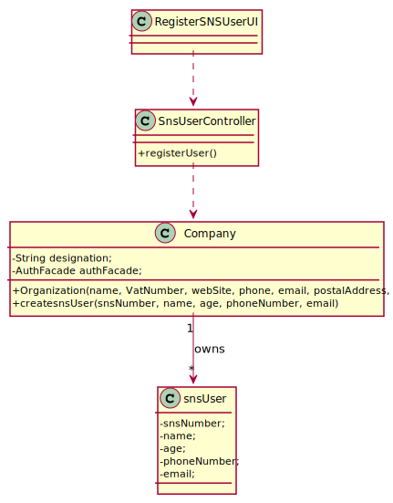

# US 003 -  To create an Sns User.

## 1. Requirements Engineering

### 1.1. User Story Description

As a receptionist, I want to register a SNS user.

### 1.2. Customer Specifications and Clarifications

**From the specifications document:**

> Receptionist registers the SNS user and adds it to the company users.

### 1.3. Acceptance Criteria

* **AC1:** The SNS user must become a system user. The "auth" component available on the repository must be reused (without modifications)

### 1.4. Found out Dependencies

* There is no dependencies.

### 1.5 Input and Output Data

**Input Data:**

* Typed data:
    * an SnsNumber,
    * a name,
    * an age,
    * a phone Number,
    * an email

### 1.6. System Sequence Diagram (SSD)

**Alternative 1**

**Other alternatives might exist.**

### 1.7 Other Relevant Remarks

* The sns user is after showed registered

## 2. OO Analysis

### 2.1. Relevant Domain Model Excerpt

### 2.2. Other Remarks
n/a

## 3. Design - User Story Realization

### 3.1. Rationale

**SSD - Alternative 1 is adopted.**

| Interaction ID | Question: Which class is responsible for... | Answer  | Justification (with patterns)  |
|:-------------  |:--------------------- |:------------|:---------------------------- |
| Step 1  		 |	... interacting with the actor? | RegisterSNSUserUI  |  Pure Fabrication: there is no reason to assign this responsibility to any existing class in the Domain Model.           |
|			  		 |	... coordinating the US? | SnsUserController | Controller                             |
| Step 2		  		 |	... instantiating a new User? | Company   | Creator (Rule 1): in the DM Company has an sns user.   |
| Step 3  		 |	...saving the inputted data? | SnsUser  | IE: object created in step 1 has its own data.  |								 |             |                              |              
| Step 4 		 |	... validating all data (local validation)? | SnsUser | IE: owns its data.| 
| 			  		 |	... validating all data (global validation)? | Company | IE: knows all its users.| 
| 			  		 |	... saving the created users? | Company | IE: owns all its users.| 
|Step 5		 |	... informing operation success?| CreateTaskUI  | IE: is responsible for user interactions.  | 

### Systematization ##

According to the taken rationale, the conceptual classes promoted to software classes are:

* Company
* Receptionist
* SnsUser

Other software classes (i.e. Pure Fabrication) identified:

* RegisterSnsUserUI
* SnsUserController

## 3.2. Sequence Diagram (SD)

**Alternative 1**

## 3.3. Class Diagram (CD)

**From alternative 1**

# 4. Tests

**Test 1:** Check that it is not possible to create an instance of the Task class with null values.

	@Test(expected = IllegalArgumentException.class)
		public void ensureNullIsNotAllowed() {
		Task instance = new Task(null, null, null, null, null, null, null);
	}

**Test 2:** Check that it is not possible to create an instance of the Task class with a reference containing less than five chars - AC2.

	@Test(expected = IllegalArgumentException.class)
		public void ensureReferenceMeetsAC2() {
		Category cat = new Category(10, "Category 10");
		
		Task instance = new Task("Ab1", "Task Description", "Informal Data", "Technical Data", 3, 3780, cat);
	}

*It is also recommended to organize this content by subsections.* 

# 5. Construction (Implementation)

## Class SnsUserController

		 public SnsUser registerUser(int snsNumber, String name, int age, int phoneNumber, String email) {
        Company company = new Company();
        SnsUser snsUser= company.createsnsUser(snsNumber,name,age,phoneNumber,email);
			return (this.snsUser != null);
		}

## Class Organization

	public SnsUser createsnsUser(int snsNumber, String name, int age, int phoneNumber, String email) {
        SnsUser snsUser = new SnsUser(snsNumber, name, age, phoneNumber, email);
        return snsUser;
    }

# 6. Integration and Demo

* A new option on the Employee menu options was added.

* Some demo purposes some users are bootstrapped while system starts.

# 7. Observations

None.
