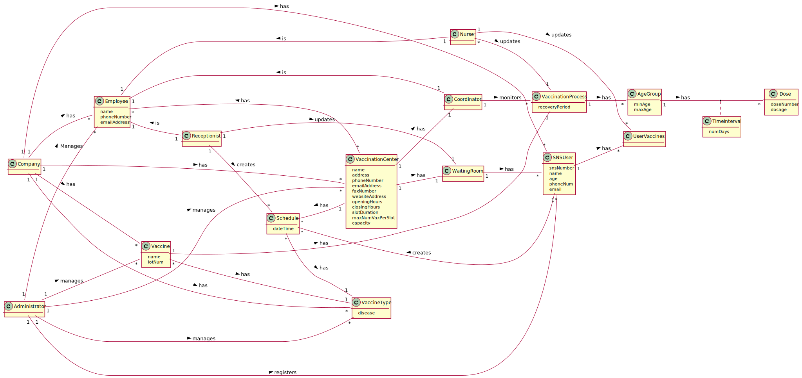

# OO Analysis #

The construction process of the domain model is based on the client specifications, especially the nouns (for _concepts_) and verbs (for _relations_) used. 

## Rationale to identify domain conceptual classes ##
To identify domain conceptual classes, start by making a list of candidate conceptual classes inspired by the list of categories suggested in the book "Applying UML and Patterns: An Introduction to Object-Oriented Analysis and Design and Iterative Development". 

### _Conceptual Class Category List_ ###

**Business Transactions**

* Vaccinate SNSUser and give him certificate

---

**Transaction Line Items**

* Vaccine
* DGS Vaccination Certificate

---

**Product/Service related to a Transaction or Transaction Line Item**

*  Vaccination Process

---

**Transaction Records**

*  SNSUser Vaccine Schedules

---  

**Roles of People or Organizations**

* Nurse
* Receptionist
* Coordinator
* Administrator
* SNSUser

---

**Places**

*  VaccinationCenter

---

**Noteworthy Events**

* Vaccination Process
* Time interval between vaccinations
* Recovery period after vaccination

---

**Physical Objects**

* Vaccine

---

**Descriptions of Things**

*  

---

**Catalogs**

*  Vaccine Types and Vaccines

---

**Containers**

*  Vaccine contains a dosage

---

**Elements of Containers**

*  Dosage

---

**Organizations**

*  

---

**Other External/Collaborating Systems**

*  

---

**Records of finance, work, contracts, legal matters**

* 

---

**Financial Instruments**

*  

---

**Documents mentioned/used to perform some work/**

* 
---

###**Rationale to identify associations between conceptual classes**###

An association is a relationship between instances of objects that indicates a relevant connection and that is worth of remembering, or it is derivable from the List of Common Associations: 

+ **_Administrator_** manages **_Employee_**
+ **_Administrator_** manages **_Vaccine_**
+ **_Administrator_** manages **_VaccinationCenter_**
+ **_Administrator_** manages **_VaccineType_**
+ **_Administrator_** registers new **_SNSUser_**
+ **_Nurse_** is a part of **_Employee_**
+ **_Nurse_** updates **_SNSUser_**
+ **_Nurse_** updates **_VaccinationProcess_**
+ **_Coordinator_** monitors **_VaccinationProcess_**
+ **_VaccinationCenter_** has only one **_Coordinator_**
+ **_VaccinationCenter_** has multiple **_Employee_**
+ **_VaccinationCenter_** has multiple **_Schedule_**
+ **_VaccinationCenter_** has multiple **_SNSUser_**
+ **_Receptionist_** is a part of **_Employee_**
+ **_Receptionist_** updates **_VaccinationCenter_**
+ **_Receptionist_** creates new **_Schedule_**
+ **_Coordinator_** is a part of **_Employee_**
+ **_SNSUser_** has **_Vaccine_**
+ **_SNSUser_** creates **_Schedule_**
+ **_VaccineType_** has multiple **_Vaccine_**
+ **_VaccineType_** is in multiple **_Schedule_**
+ **_Vaccine_** has a **_VaccinationProcess_**
+ **_VaccinationProcess_** has multiple **_AgeGroup_**
+ **_AgeGroup_** has multiple **_Dose_**
+ **_AgeGroup_** is associated to **_TimeInterval_**

| Concept (A) 		        |  Association   	  |        Concept (B) |
|-----------------------|:-----------------:|-------------------:|
| Administrator  	      |  manages    		 	  |           Employee |
| Administrator  	      |  manages    		 	  |            Vaccine |
| Administrator  	      |  manages    		 	  |  VaccinationCenter |
| Administrator  	      |  manages    		 	  |        VaccineType |
| Administrator  	      | registers    		 	 |            SNSUser |
| Nurse  	              |    is    		 	     |           Employee |
| Nurse  	              |  updates    		 	  |            SNSUser |
| Nurse  	              |  updates    		 	  | VaccinationProcess |
| Receptionist  	       |    is    		 	     |           Employee |
| Receptionist  	       |  updates    		 	  |  VaccinationCenter |
| Receptionist  	       |  creates    		 	  |           Schedule |
| Coordinator  	        |    is    		 	     |           Employee |
| Coordinator  	        | monitors    		 	  | VaccinationProcess |
| VaccinationCenter  	  |    has    		 	    |        Coordinator |
| VaccinationCenter  	  |    has    		 	    |           Employee |
| VaccinationCenter  	  |    has    		 	    |           Schedule |
| VaccinationCenter  	  |    has    		 	    |            SNSUser |
| SNSUser  	            |    has    		 	    |            Vaccine |
| SNSUser  	            |  creates    		 	  |           Schedule |
| VaccineType  	        |    has    		 	    |            Vaccine |
| Vaccine  	            |    has    		 	    | VaccinationProcess |
| Schedule  	           |    has    		 	    |        VaccineType |
| VaccinationProcess  	 |    has    		 	    |           AgeGroup |
| AgeGroup  	           |    has    		 	    |               Dose |
| AgeGroup  	           |    has    		 	    |       TimeInterval |

## Domain Model

**Do NOT forget to identify concepts atributes too.**

**Insert below the Domain Model Diagram in a SVG format**

