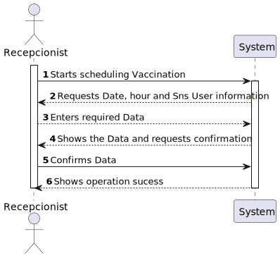
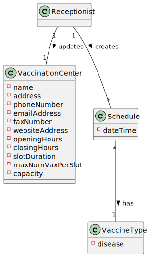
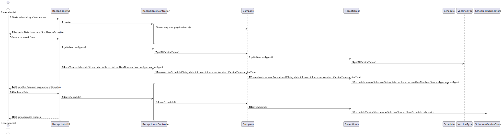
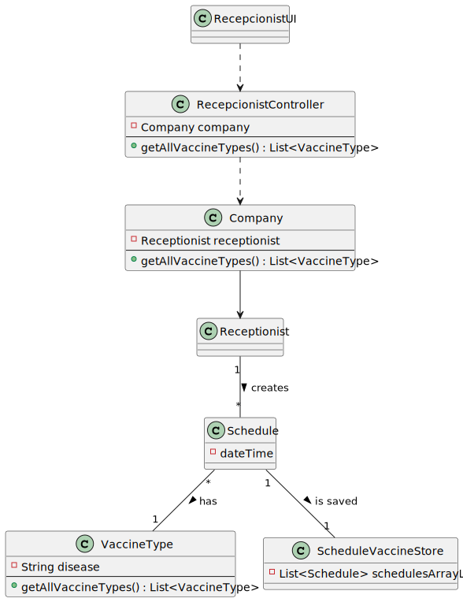

# US2: As a receptionist at one vaccination center, I want to schedule a vaccination

## 1. Requirements Engineering

### 1.1. User Story Description

As a receptionist at one vaccination center, I want to schedule a vaccination

### 1.2. Customer Specifications and Clarifications

*From the specifications document:*
> No duplicate entries should be possible for the same SNS user on the same day or vaccine period.

*From the client clarifications:*
> *Question:* "Question: When a receptionist schedules a vaccination for an SNS user, should they be presented with a list of available vaccines (brands, that meet acceptance criteria) from which to choose? Or should the application suggest only one?"
>
> *Answer:* The receptionist do not select the vaccine brand.When the user is at the vaccination center to take the vaccine, the nurse selects the vaccine. In Sprint D we will introduce new USs where the nurse records the administration of a vaccine to a SNS user.
-
> *Question:* "When the chosen vaccination center is a Community Mass Vaccination Center(CMVC), it will provide only one vaccine type to be scheduled. However, vaccine type is not an atributte of CMVC. Are we allowed to create an attribute of vaccine type in CMVC object?"
>
> *Answer:* Please study ESOFT and discuss this issue with ESOFT teachers.

### 1.3. Acceptance Criteria

* *AC1:* The algorithm should check if the SNS User is within the
  age and time since the last vaccine.

### 1.4. Found out Dependencies

* No found dependencies

### 1.5 Input and Output Data

**Input Data:**

* Typed data:
    * SNS User Info
    * Date
    * Hour

**Output Data:**

### 1.6. System Sequence Diagram (SSD)

**Alternative 1**

**Other alternatives might exist.**

### 1.7 Other Relevant Remarks

* SNS User must exist in order to be checked-in

## 2. OO Analysis

### 2.1. Relevant Domain Model Excerpt

### 2.2. Other Remarks

n/a

## 3. Design - User Story Realization

### 3.1. Rationale

**SSD - Alternative 1 is adopted.**

| Interaction ID | Question: Which class is responsible for...             | Answer                      | Justification (with patterns)       |
|:---------------|:--------------------------------------------------------|:----------------------------|:------------------------------------|
| Step 1  		     | 	... starts scheduling a Vaccination?                   | ReceptionistUI              | Receptionist inserts data from user |
| Step 4	        | 	... validating all data (local validation)?            | ReceptionistUI              | IE: owns its data.                  |	
| Step 5	        | 	... enters required data?                              | ReceptionistUI              |      IE: owns its data.                                 |
| Step 14		      | ... Shows the Data and requests confirmation            | ReceptionistUI              |     IE: owns its data.                              | 
| Step 15		      | ... Confirms Data                                       | ReceptionistUI              |        IE: knows everything about SNSUsers.                             |
| Step 20		      | ... informing operation success?                        | ReceptionistUI              |   IE: is responsible for user interactions.                                  |

### Systematization ##

## 3.2. Sequence Diagram (SD)

**Alternative 1**

## 3.3. Class Diagram (CD)

**From alternative 1**

# 4. Tests

# 5. Construction (Implementation)
    
# 6. Integration and Demo

# 7. Observations

