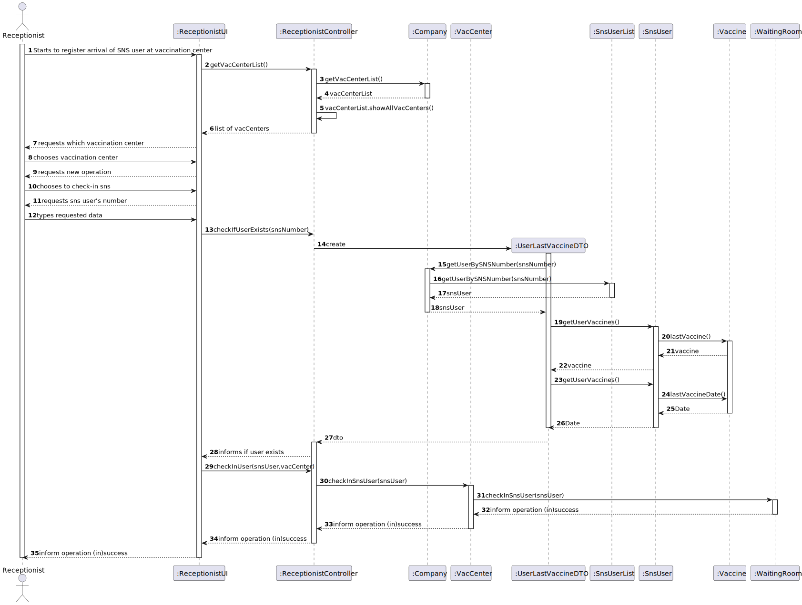

# US 004 - As a receptionist at a vaccination center, I want to register the arrival of a SNS user to take the vaccine.

## 1. Requirements Engineering

### 1.1. User Story Description

As an administrator, I intend to specify a new vaccine type.

### 1.2. Customer Specifications and Clarifications

*From the specifications document:*

> No duplicate entries should be possible for the same SNS user on the same day or vaccine period.

*From the client clarifications:*

> *Question:* "When the receptionist registers a SNSUser arrival, should we validate that the vaccination center where the SNS user arrives is the same as where the receptionist is currently working? If so, should we allocate receptionists to vaccination centers, i.e., ask the receptionist which vaccination center is she currently working at?" 
>  
> *Answer:* To start using the application, the receptionist should first select the vaccination center where she is working. The receptionists register the arrival of a SNS user at the vaccination center where she is working.

-

> *Question:* "Regarding US04, what are the attributes needed in order to register the arrival of a SNS user to a vaccination center".
>  
> *Answer:* The time of arrival should be registered.

### 1.3. Acceptance Criteria

* *AC1:* No duplicate entries should be possible for the same SNS user on the same day or vaccine period.

### 1.4. Found out Dependencies

* No found dependencies

### 1.5 Input and Output Data

**Input Data:**

* Typed data:
    * a vaccination center
    * a SNS number
    

**Output Data:**

* List of Vaccinations centers
* In(success) of check-in

### 1.6. System Sequence Diagram (SSD)

**Alternative 1**

**Other alternatives might exist.**

### 1.7 Other Relevant Remarks

* SNS User must exist in order to be checked-in

## 2. OO Analysis

### 2.1. Relevant Domain Model Excerpt 

### 2.2. Other Remarks

n/a

## 3. Design - User Story Realization 

### 3.1. Rationale

**SSD - Alternative 1 is adopted.**

| Interaction ID | Question: Which class is responsible for...   | Answer                 | Justification (with patterns)                                                                                 |
|:---------------|:----------------------------------------------|:-----------------------|:--------------------------------------------------------------------------------------------------------------|
| Step 1  		     | 	... interacting with the actor?              | ReceptionistUI         | Pure Fabrication: there is no reason to assign this responsibility to any existing class in the Domain Model. |
| 			  		        | 	... coordinating the US?                     | ReceptionistController | Controller                                                                                                    |
| Step 7		  		   | 	... instantiating a new UserLastVaccineDTO?  | Company                | Creator (Rule 4) and DTO: in the DM, Company  has the data used to initialize UserLastVaccineDTO.             |
| 		             | 	...saving the inputted data?                 | WaitingRoom            | IE: object created in step 7 has its own data.                                                                |								 |             |                              |              
| 		             | 	... validating all data (local validation)?  | WaitingRoom            | IE: owns its data.                                                                                            | 
| 			  		        | 	... validating all data (global validation)? | Company                | IE: knows everything about SNSUsers.                                                                          | 
| 			  		        | 	... saving the created UserLastVaccineDTO?        | WaitingRooms           | IE: owns all the UserLastVaccineDTO.                                                                                            | 
| Step 8		       | 	... informing operation success?             | VaccineUI              | IE: is responsible for user interactions.                                                                     | 

### Systematization ##

## 3.2. Sequence Diagram (SD)

**Alternative 1**

## 3.3. Class Diagram (CD)

**From alternative 1**

# 4. Tests 

# 5. Construction (Implementation)

## Class ReceptionistController 
  
    Company company;
    public ReceptionistController(Company company){
    this.company = company;
    }

    public List<VacCenter> getVacCenterList(){
        return this.company.getVacCenterList().showAllVacCenters();
    }

    public boolean checkInUser(UserLastVaccineDTO snsUser, VacCenter vacCenter){
        return vacCenter.checkInSnsUser(snsUser);
    }

    public boolean checkOutUser(UserLastVaccineDTO snsUser, VacCenter vacCenter){
        return vacCenter.checkOutSnsUser(snsUser);
    }

    public UserLastVaccineDTO checkIfUserExists(int snsNumber){
        return this.company.createDTO(snsNumber);
    }

## Class Organization

    private final List<UserLastVaccineDTO> latestEntries; //Users that entered the waiting room today
    private final List<UserLastVaccineDTO> snsUserList; //Users currently on waiting room
    private final List<LocalDateTime> dateTimeOfArrival;//Arraival time of said users

    public WaitingRoom(){
        this.latestEntries=new ArrayList<>();
        this.snsUserList=new ArrayList<>();
        this.dateTimeOfArrival=new ArrayList<>();
    }

    public boolean checkInSnsUser(UserLastVaccineDTO snsUser){

        if(snsUserList.contains(snsUser))
            return false;
        else{
            Vaccine lastUserVaccine = snsUser.getLastVaccine();
            LocalDateTime date = snsUser.getLastVaccineDate();
            if(lastUserVaccine!=null){
                int userAge = snsUser.getAge();
                AgeGroup ageGroup = lastUserVaccine.getVaccinationProcess().getBelongingAgeGroup(userAge);
                LocalDateTime nextPossibleDate = date.plusDays(ageGroup.getTimeInterval().getNumDays());
                if(nextPossibleDate.isBefore(LocalDateTime.now()) && !visitedToday(snsUser)) {
                    latestEntries.add(snsUser);
                    dateTimeOfArrival.add(LocalDateTime.now());
                    return snsUserList.add(snsUser);
                }else return false;

            }else {
                if(visitedToday(snsUser))
                    return false;
                else {
                    latestEntries.add(snsUser);
                    dateTimeOfArrival.add(LocalDateTime.now());
                    return snsUserList.add(snsUser);
                }
            }
        }
    }

    private boolean visitedToday(UserLastVaccineDTO snsUser){
        return latestEntries.contains(snsUser);
    }

    public boolean checkOutSnsUser(UserLastVaccineDTO snsUser){
        if(!snsUserList.contains(snsUser))
            return false;
        else{
            dateTimeOfArrival.remove(snsUserList.indexOf(snsUser));
            return snsUserList.remove(snsUser);
        }
    }

# 6. Integration and Demo 
* A new option on the Receptionist menu options was added.

# 7. Observations

None.

