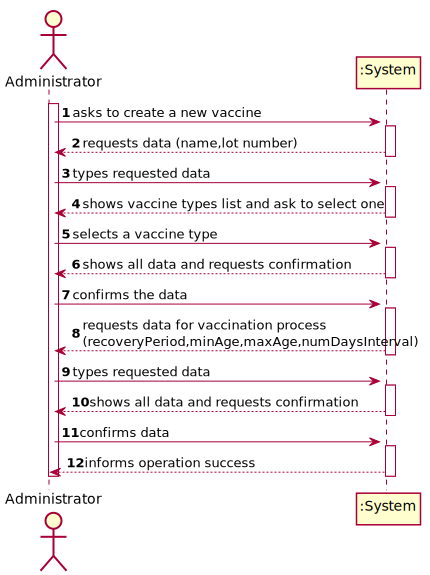
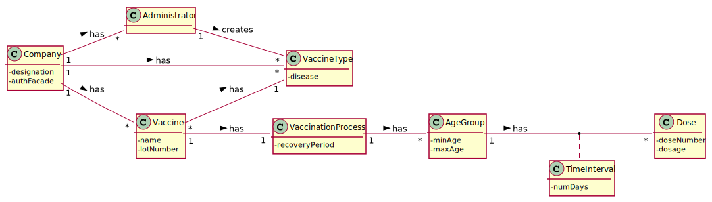
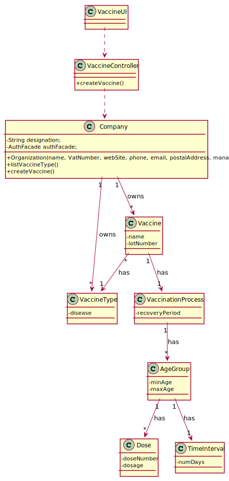

# US 013 - Specify new vaccine and its administration process 

## 1. Requirements Engineering

### 1.1. User Story Description

As an administrator, I intend to specify a new vaccine and its administration process.

### 1.2. Customer Specifications and Clarifications

*From the specifications document:*

> [...] it is worth noticing that for each type of vaccine, several vaccines might exist, each one demanding a distinct administration process.

> The vaccine administration process comprises (i) one or more age groups (e.g.: 5 to 12 years old, 13 to 18 years old, greater than 18 years old), and (ii) per age group, the doses to be administered (e.g.: 1, 2, 3), the vaccine dosage (e.g.: 30 ml), and the time interval regarding the previously administered dose. Regarding this, it is important to notice that between doses (e.g.: between the 1st and 2nd doses) the dosage to be administered might vary as well as the time interval elapsing between two consecutive doses (e.g.: between the 1st and 2nd doses 21 days might be required, while between the 2nd and the 3rd doses 6 months might be required).

*From the client clarifications:*

> *Question:* Which attributes does the Vaccine have (besides the ones refering to the Vaccine Type)?
>
> *Answer:* Each vaccine has the following attributes: Id, Name, Brand, Vaccine Type, Age Group, Dose Number, Vaccine Dosage and Time Since Last Dose.

> *Question:* We would like to know if when specifying a new Vaccine and its Administration Process, should a list of the existing types of vaccines be displayed in order for him to choose one, or should he just input it?
>
> *Answer:* If the information is available in the system, it is a good practice to present the information to the user and ask the user to select.

> *Question:* As to the interval between doses, what time format are we to use? (e.g. days, weeks, months)
>
> *Answer:* Number of days.

### 1.3. Acceptance Criteria

* *AC1:* The new vaccine can't have the same Id as a previously created vaccine.
* *AC2:* All required data must be filled.
* *AC3:* The age limits for the age groups should be coherent.

### 1.4. Found out Dependencies

* There is a dependency to "US012 Create a vaccine type" since a vaccine type must exist to create a vaccine

### 1.5 Input and Output Data

**Input Data:**

* Typed data:
    * a name
    * a lot number
	
* Selected data:
    * Vaccination Process

**Output Data:**

* Vaccine Info
* Vaccination Process
* In(success) of Operation

### 1.6. System Sequence Diagram (SSD)

**Alternative 1**

**Other alternatives might exist.**

### 1.7 Other Relevant Remarks

To clarify this client response: "A vaccine has the following attributes: ID, Name, Brand, Vaccine Type, Age Group, Dose
Number, Vaccine Dosage and Time Since Last Dose". Each vaccine has those attributes, but when specifying a new vaccine (
which is different from the Nurse related US of registering a vaccine), there should also be another attribute, the
Administration Process.  
There's also the possibility that there will be a "GivenVaccine" class that would have those attributes, since those are
related to a vaccine that was given and not to an actual Vaccine like the project description describes:
"For instance, for the Covid-19 type, there is (i) the Pfizer vaccine, (ii) the Moderna vaccine, (iii) the AstraZeneca
vaccine, and so on"

Summarizing, there should be Vaccine Types (Covid-19, Flu, etc...)/(Even to the same disease but using different technologies), to those types there should be different Vaccines (
Pfizer, Moderna, etc...), and then there should be a Given Vaccine class, where there is all the information about a
vaccine that was given:
ID, Name, Brand, Vaccine Type, Age Group, Dose Number, Vaccine Dosage and Time Since Last Dose.

## 2. OO Analysis

### 2.1. Relevant Domain Model Excerpt 

### 2.2. Other Remarks

## 3. Design - User Story Realization 

### 3.1. Rationale

**SSD - Alternative 1 is adopted.**

| Interaction ID | Question: Which class is responsible for...   | Answer            | Justification (with patterns)                                                                                      |
|:-------------  |:----------------------------------------------|:------------------|:-------------------------------------------------------------------------------------------------------------------|
| Step 1  		 | 	... interacting with the actor?              | VaccineUI         | Pure Fabrication: there is no reason to assign this responsibility to any existing class in the Domain Model.      |
|			  		 | 	... coordinating the US?                     | VaccineController | Controller                                                                                                         |
| Step 2		  		 | 	... instantiating a new Vaccine?             | Company           | Creator (Rule 1): in the DM, Company has vaccine.                                                                  |
| Step 3  		 | 	...saving the inputted data?                 | Vaccine      | IE: object created in step 1 has its own data.                                                                     |								 |             |                              |              
| Step 4 		 | 	... validating all data (local validation)?  | Vaccine      | IE: owns its data.                                                                                                 | 
| 			  		 | 	... validating all data (global validation)? | Company           | IE: knows all its vaccine.                                                                                         | 
| 			  		 | 	... saving the created vaccine types?        | Company           | IE: owns all its vaccine.                                                                                          | 
|Step 5		 | 	... informing operation success?             | VaccineUI         | IE: is responsible for user interactions.                                                                          | 

### Systematization ##

## 3.2. Sequence Diagram (SD)

**Alternative 1**

## 3.3. Class Diagram (CD)

**From alternative 1**

# 4. Tests 

# 5. Construction (Implementation)

## Class VaccineController 
    private final Company company;
    public VaccineController(){
    this.company = new Company();
    }

    public VaccineType registerVaccineType(String disease) {
        return company.createVaccineType(disease);
    }

    public List<VaccineType> listVaccineTypes() {
        return company.listVaccineTypes();
    }

    public Vaccine createVaccine(String name, int lotnumber, VaccineType vaccineType, VaccinationProcess vaccinationProcess){
       return company.createVaccine(name,lotnumber,vaccineType,vaccinationProcess);

    }

    public List<Vaccine> listVaccine() {
        return company.listVaccine();
    }

    public VaccinationProcess createVaccinationProcess(int recoveryPeriod, List<AgeGroup> ageGroupList){
        return null;
    }

    public AgeGroup createAgeGroup(int minAge, int maxAge, int numDaysInterval){
        return company.createAgeGroup(minAge,maxAge,numDaysInterval);
    }

## Class Organization

     public Vaccine createVaccine(String name, int lotNumber,VaccineType vaccineType,VaccinationProcess vaccinationProcess) {
        Vaccine vaccine = new Vaccine(name,lotNumber,vaccineType,vaccinationProcess);
        this.vaccineList.add(vaccine);
        return vaccine;
    }
    public List<Vaccine> listVaccine() {
        return this.vaccineList;
    }

# 6. Integration and Demo 

* A new option on the Employee menu options was added.
# 7. Observations

None.

