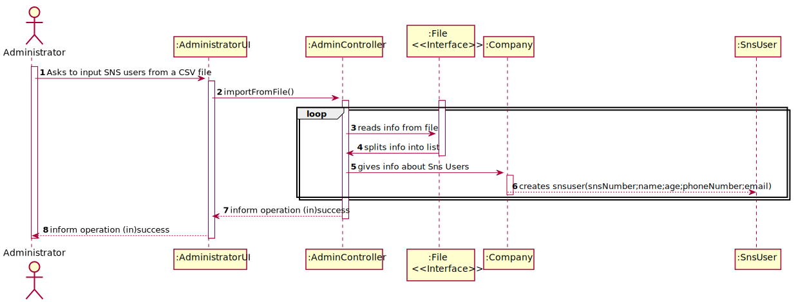

# US 014 - As an administrator, I want to load a set of users from a CSV file.

## 1. Requirements Engineering

### 1.1. User Story Description

As an administrator, I want to load a set of users from a CSV file

### 1.2. Customer Specifications and Clarifications

None

### 1.3. Acceptance Criteria

* *AC1:* The application must support importing two types of CSV
  files: a) one type must have a header, column separation is done using “;”
  character; b) the other type does not have a header, column separation is done
  using “,” character.

### 1.4. Found out Dependencies

* No found dependencies

### 1.5 Input and Output Data

**Input Data:**

* Typed data:
    * a file name
   

**Output Data:**

* List of new SNS users now in the company

### 1.6. System Sequence Diagram (SSD)

**Alternative 1**

**Other alternatives might exist.**

### 1.7 Other Relevant Remarks

* SNS User must exist in order to be checked-in

## 2. OO Analysis

### 2.1. Relevant Domain Model Excerpt

### 2.2. Other Remarks

n/a

## 3. Design - User Story Realization

### 3.1. Rationale

**SSD - Alternative 1 is adopted.**

| Interaction ID | Question: Which class is responsible for...   | Answer                 | Justification (with patterns)                                                                                 |
|:---------------|:----------------------------------------------|:-----------------------|:--------------------------------------------------------------------------------------------------------------|
| Step 1  		     | 	... interacting with the actor?              | AdministratorUI         | Pure Fabrication: there is no reason to assign this responsibility to any existing class in the Domain Model. |
| 			  		        | 	... coordinating the US?                     | AdminController | Controller                                                                                                    
| 		             | 	...saving the inputted data?                 | File          | INTERFACE                                                              |								 |             |                              |              
| Step 7		  		   | 	... instantiating a new User  | Company                | Creator of SNSusers          |

### Systematization ##

## 3.2. Sequence Diagram (SD)

**Alternative 1**

## 3.3. Class Diagram (CD)

**From alternative 1**

# 4. Tests

# 5. Construction (Implementation)

## Class AdminController

    private final Company company;

    public AdminController(Company company){
        this.company=company;
    }

    public List importFromFile(String filename,int option) throws FileNotFoundException {
        boolean header = true;
        List<List<String>> records = new ArrayList<>();
        try (BufferedReader br = new BufferedReader(new FileReader(filename))) {
            String line;
            while ((line = br.readLine()) != null) {
                if (option==1){
                    String[] values = line.split(";");
                    if (header &&  !(values[0].indexOf(0)<= 9 && values[0].indexOf(0) >= 0))
                        header = false;
                    else records.add(Arrays.asList(values));
                }
                else{
                    String[] values = line.split(",");
                    records.add(Arrays.asList(values));
                }

            }
        } catch (IOException e) {
            e.printStackTrace();
        }
        for (List<String> user: records) {
            this.company.createSnsUser(Integer.parseInt(user.get(0)),
                                        user.get(1),
                                        Integer.parseInt(user.get(2)),
                                        user.get(3),
                                        user.get(4));
        }
        printList();
        return records;
    }

    public void printList() {
        for (SnsUser user:this.company.listSnsUser()) {
            System.out.println(user.toString());
        }
    }

# 6. Integration and Demo
* A new option on the Receptionist menu options was added.

# 7. Observations

None.

