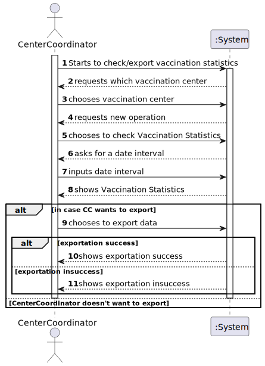
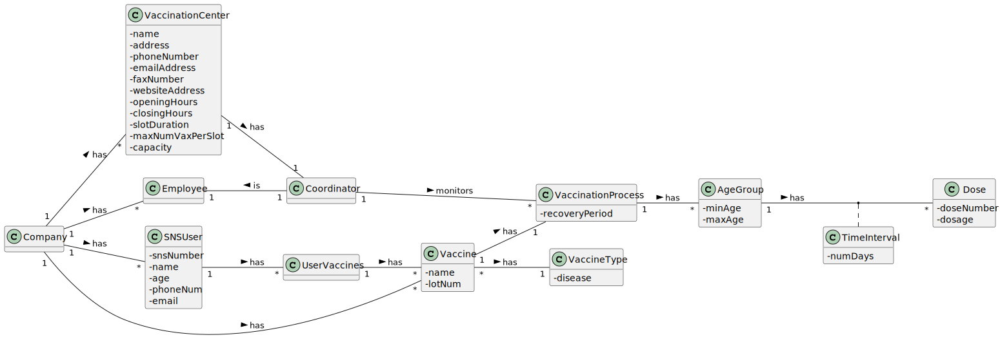
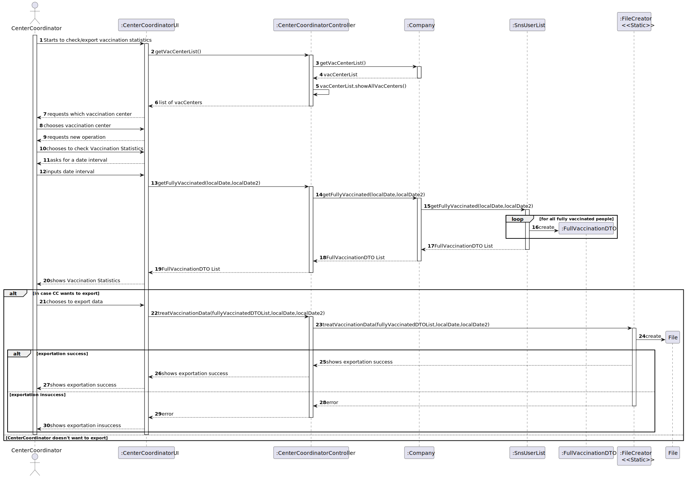

# US 015 - As a center coordinator, I intend to check and export vaccination statistics. I want to export, to a csv file, the total number of fully vaccinated users per day.

## 1. Requirements Engineering

### 1.1. User Story Description

As a center coordinator, I intend to check and export vaccination statistics. I want to export, to a csv file, the total number of fully vaccinated users per day.

### 1.2. Customer Specifications and Clarifications

*From the client clarifications:*

> *Question:* "When exporting vaccination statistics,do we export the data from all days available in the system or does the center coordinator chooses the time interval?"
>
> *Answer:* "The user should define a time interval (two dates)"

-

> *Question:* "Is there any kind of format our exported data should follow?".
>
> *Answer:* "Data format: date; number of fully vaccinated user."

### 1.3. Acceptance Criteria

* No found acceptance criteria

### 1.4. Found out Dependencies

* No found dependencies

### 1.5 Input and Output Data

**Input Data:**

* Typed data:
    * a first date
    * a second date

**Output Data:**

* List of vaccinated people between the two given dates
* A csv file containing the list of vaccinated people between the two given dates

### 1.6. System Sequence Diagram (SSD)

**Alternative 1**

**Other alternatives might exist.**

### 1.7 Other Relevant Remarks

## 2. OO Analysis

### 2.1. Relevant Domain Model Excerpt

### 2.2. Other Remarks

n/a

## 3. Design - User Story Realization

### 3.1. Rationale

**SSD - Alternative 1 is adopted.**

| Interaction ID | Question: Which class is responsible for...   | Answer              | Justification (with patterns)                                                                                 |
|:---------------|:----------------------------------------------|:--------------------|:--------------------------------------------------------------------------------------------------------------|
| Step 1  		     | 	... interacting with the actor?              | CenterCoordinatorUI | Pure Fabrication: there is no reason to assign this responsibility to any existing class in the Domain Model. |
| 			  		        | 	... coordinating the US?                     | VacCenterController | Controller                                                                                                    |
| Step 7		  		   | 	... instantiating a new FullVaccinationDTO?             | SnsUserList             | Creator (Rule 4) and DTO: in the DM, SnsUserList has the data used to initialize FullVaccinationDTO.          |
| 		             | 	... validating all data (local validation)?  | SnsUserList         | IE: owns its data.                                                                                            | 
| 			  		        | 	... validating all data (global validation)? | SnsUserList             | IE: knows everything about SNSUsers.                                                                          | 
| Step 8		       | 	... informing operation success?             | CenterCoordinatorUI           | IE: is responsible for user interactions.                                                                     | 

### Systematization ##

## 3.2. Sequence Diagram (SD)

**Alternative 1**

## 3.3. Class Diagram (CD)

**From alternative 1**

# 4. Tests

# 5. Construction (Implementation)

## Class VacCenterController
    private final Company company;
    public VacCenterController(Company company) {
    this.company=company;
    }

    public List<VacCenter> listVacCenters(){
        return company.getVacCenterList().showAllVacCenters();
    }

    public List<FullVaccinationDTO> getFullyVaccinated(LocalDate localDate, LocalDate localDate2){
         return this.company.getFullyVaccinated(localDate,localDate2);
    }

    public void treatVaccinationData(List<FullVaccinationDTO> fullVaccinationDTOS,LocalDate localDate, LocalDate localDate2) throws FileNotFoundException {
        FileCreator.treatVaccinationData(fullVaccinationDTOS, localDate, localDate2);
    }

## Class Organization

    private final List<SnsUser> snsUserList = new ArrayList<>();
    public SnsUserList(){
    }

    public SnsUser createSnsUser(int snsNumber, String name, int age, String phoneNumber, String email) {
        SnsUser snsUser = new SnsUser(snsNumber, name, age, phoneNumber, email);
        this.snsUserList.add(snsUser);
        return snsUser;
    }

    public List<SnsUser> listSnsUser() {
        return this.snsUserList;
    }

    public List<FullVaccinationDTO> getFullyVaccinated(LocalDate localDate, LocalDate localDate2){
        List<FullVaccinationDTO> fullyVaccinated = new ArrayList<>();
        for (SnsUser snsUser: snsUserList) {
            if(!snsUser.getUserVaccines().getUserVaccinesDto().isEmpty()){
                for (UserVaccinesDTO userVaccine: snsUser.getUserVaccines().getUserVaccinesDto()) {
                    if(userVaccine.endedVaccination()){
                        LocalDate userLastDoseDate = userVaccine.lastDoseDate().toLocalDate();
                        if(userLastDoseDate.isAfter(localDate)&&userLastDoseDate.isBefore(localDate2))
                            fullyVaccinated.add(new FullVaccinationDTO(snsUser.getSnsNumber(),userVaccine.lastDoseDate().toLocalDate()));
                    }
                }
            }
        }
        return fullyVaccinated;
    }

# 6. Integration and Demo
* A new option on the Center Coordinator menu options was added.

# 7. Observations

None.

