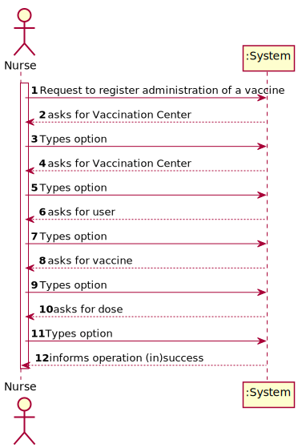
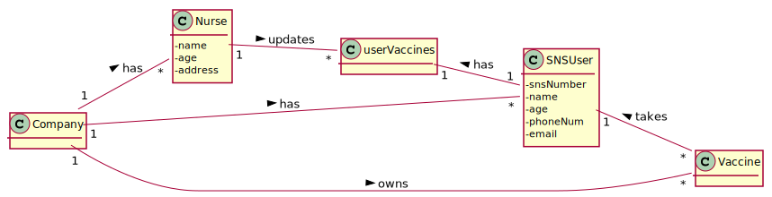
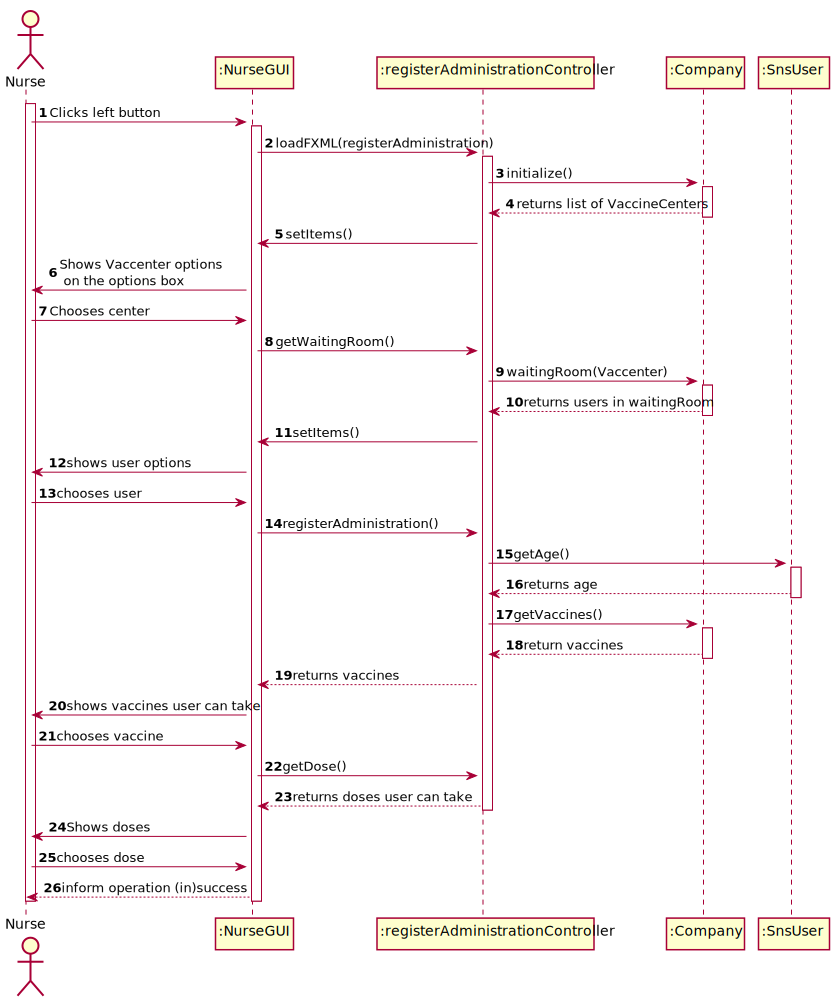
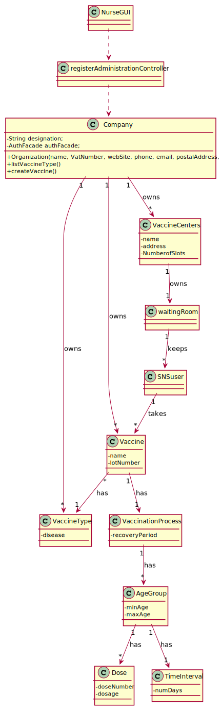

# US 08 - As a Nurse, I want to register an vaccine Administration

## 1. Requirements Engineering

### 1.1. User Story Description

As a Nurse, I want to record the administration of a vaccine 

### 1.2. Customer Specifications and Clarifications

None

### 1.3. Acceptance Criteria

* *AC1:* Nurse should choose the vaccine and dose number
### 1.4. Found out Dependencies

* Nurse login
* Vaccines
* Vaccine centers
* users
* users in waiting room
### 1.5 Input and Output Data

**Input Data:**
* Vaccine Center
* User in waiting room
* Vaccine
* Dose

### 1.6. System Sequence Diagram (SSD)

**Alternative 1**

**Other alternatives might exist.**

### 1.7 Other Relevant Remarks
**Other alternatives might exist.**
## 2. OO Analysis

### 2.1. Relevant Domain Model Excerpt

### 2.2. Other Remarks

n/a

## 3. Design - User Story Realization

### 3.1. Rationale

**SSD - Alternative 1 is adopted.**

| Interaction ID | Question: Which class is responsible for...   | Answer                 | Justification (with patterns)                                                                                 |
|:---------------|:----------------------------------------------|:-----------------------|:--------------------------------------------------------------------------------------------------------------|
| Step 1  		     | 	... interacting with the actor?              | NurseGUI         | Pure Fabrication: there is no reason to assign this responsibility to any existing class in the Domain Model. |
| 	Step 2		  		        | 	... coordinating the US?                     | registerAdministrationController | Controller |              
| 	Step 3 	  		   | 	... getting info  | Company                |        |

### Systematization ##

## 3.2. Sequence Diagram (SD)

**Alternative 1**

## 3.3. Class Diagram (CD)

**From alternative 1**

# 4. Tests

# 5. Construction (Implementation)

## Class registerAdministrationController

    private final AuthController authController= new AuthController();
    private Stage stage = new Stage();
    @FXML
    public AnchorPane anchorPane;

    List<VacCenter> vacCenterList;
    List<String>Vaccenters = new ArrayList();
    List<AgeGroup> ageGroupList= new ArrayList<>();
    List<String> doseList = new ArrayList<>();
    List<String> vaccineName = new ArrayList<>();
    private String vaccenteroption;
    private String UserPositionOption;
    private String vaccineOptions;
    private String doses;
    List<Vaccine> vaccineList = new ArrayList<>();
    AgeGroup ageGroup;

    @Override
    public void initialize(URL url, ResourceBundle resourceBundle) {
        MainMenuUI menuUI = new MainMenuUI();
        this.company=menuUI.newBootstrap();
        this.company.getVacCenterList().showAllVacCenters().get(0).checkInSnsUser(
                new UserLastVaccineDTO(1,"Nuno",12, LocalDateTime.now(),null)
        );
        this.vacCenterList=this.company.getVacCenterList().showAllVacCenters();
        vaccineList.add(this.company.listVaccine().get(0));

        for (int i=0;i<vacCenterList.size();i++){
            Vaccenters.add(String.valueOf(vacCenterList.get(i).getName()));
        }
        vaccenterChoice.setItems(FXCollections.observableList(Vaccenters));
    }

    public void vacCenterOption(ActionEvent actionEvent) throws ClassNotFoundException, InstantiationException, IllegalAccessException {
        this.vaccenteroption = (String) vaccenterChoice.getValue();

        setItems();
    }

    private void setItems() throws ClassNotFoundException, InstantiationException, IllegalAccessException {
        if(!(this.vaccenterChoice ==null)){
            List<String> usersWaiting = new ArrayList<>();
            for(int i = 0; i<vacCenterList.size(); i++){
                if(this.vaccenterChoice.getValue().equals(vacCenterList.get(i).getName())){
                    for(int j=0; j<vacCenterList.get(i).waitingRoom().size();j++){
                        usersWaiting.add(vacCenterList.get(i).waitingRoom().get(j).getName());
                    }
                }
            }
            System.out.println(usersWaiting);
            userOption.setItems(FXCollections.observableList(usersWaiting));
        }
    }

    public void userOption(ActionEvent actionEvent) {
        this.UserPositionOption = (String) userOption.getValue();
        for(int i = 0 ; i< vaccineList.size();i++){
            vaccineName.add(vaccineList.get(i).getName());
        }
        vaccineOption.setItems(FXCollections.observableList(vaccineName));

    }

    public void vaccineOption(ActionEvent actionEvent) {
        this.vaccineOptions = (String) vaccineOption.getValue();
        for(int i = 0; i<vacCenterList.size(); i++){
            if(this.vaccenterChoice.getValue().equals(vacCenterList.get(i).getName())){
                for(int j=0; j<vacCenterList.get(i).waitingRoom().size();j++){
                    if(Objects.equals(this.userOption.getValue(), vacCenterList.get(i).waitingRoom().get(j).getName())){
                        int age= vacCenterList.get(i).waitingRoom().get(j).getAge();
                        ageGroup = getAgeGroup(age);
                        String ageGroupString = Integer.toString(ageGroup.getDose().getDoseNumber());
                        doseList.add(ageGroupString);
                        doseOption.setItems(FXCollections.observableList(doseList));
                    }
                }
            }
        }
    }

    public void doseOption(ActionEvent actionEvent) throws IOException {
        this.doses = (String) doseOption.getValue();
        labelInform.setText("User will be informed in 30 min.");
        authController.doLogout();
        Parent adverseMenu = FXMLLoader.load(Objects.requireNonNull(getClass().getClassLoader().getResource("fxml/NurseScene.fxml")));
        Scene scene = new Scene(adverseMenu);
        Stage stage2 = new Stage();
        stage2.setScene(scene);
        stage2.setResizable(true);
        stage = (Stage) anchorPane.getScene().getWindow();
        stage.close();
        stage2.show();
    }
    public void labelInform(MouseEvent mouseEvent) {

    }

    private AgeGroup getAgeGroup(int age){
        for(int i=0; i<vaccineList.size();i++){
            if(Objects.equals(vaccineList.get(i).getName(), vaccineOptions)){
               ageGroupList= vaccineList.get(i).getVaccinationProcess().getAgeGroupList();
                for (int j =0; j< ageGroupList.size();j++){
                    if(ageGroupList.get(i).getMinAge()<= age && ageGroupList.get(i).getMaxAge()>= age){
                        return ageGroupList.get(i);
                    }
                }
            }
        }
        return null;
    }

}

# 6. Integration and Demo
* A new option on the Nurse menu options was added.

# 7. Observations

None.

